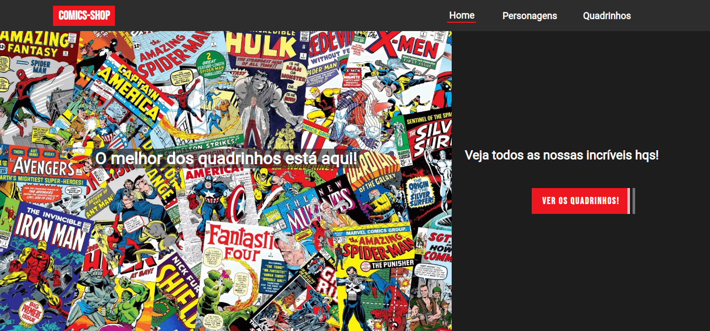
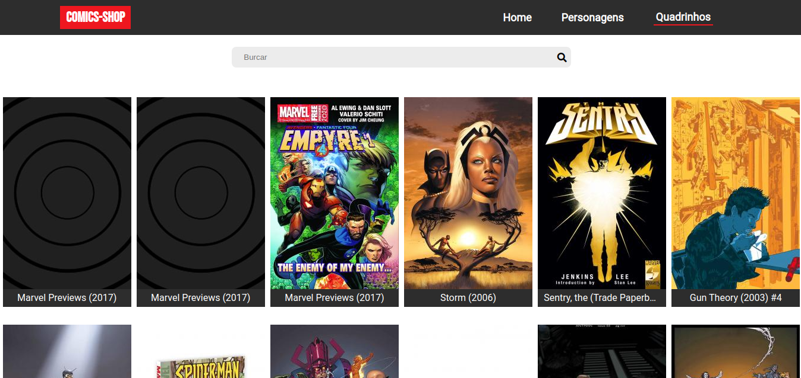
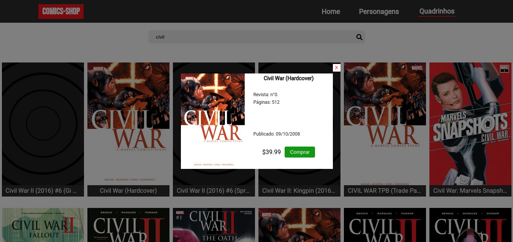
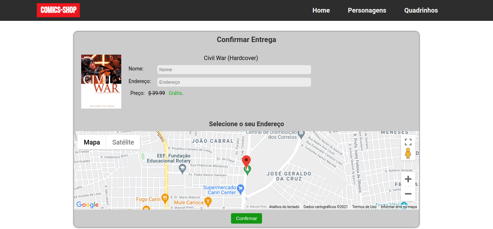
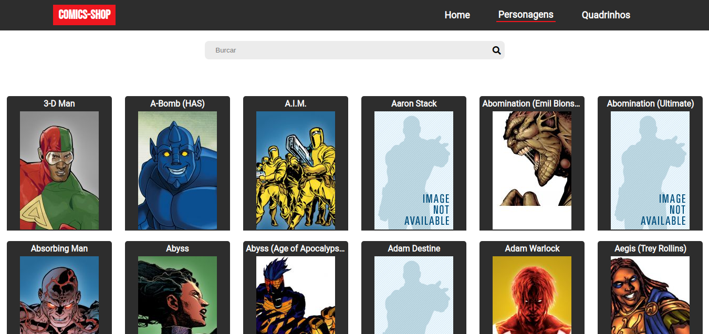

# COMICS-SHOP

Uma aplicação onde mostra uma lista de quadrinhos e personagens da Marvel. </br>
Criado utilizando React, Marvel API e Google Maps API.
</br>
O objetivo desse projeto era criar apenas uma lista de quadrinhos, um modal com as informações do quadrinho e um mapa para a escolha do endereço de entrega. Nesse momento a conversão da Longetude e Latitude para endereço não está funcionando, pois eu preciso cadastrar uma conta para o faturamento e o Google ainda está analisando os documento enviados para a confirmação.

## Demo

### Home Page



### Quadrinhos



### Modal



### Compra



### Personagens



</br>
Se você quer testar a aplicação clique no link abaixo: </br>
 [Sem link por hora](https://google.com.br/)

## Começando

Se você quer cloner esse repositório e fazer alguma modificação ou testes na sua máquina siga os passo abaixo

```
git clone git@github.com:gabriellima77/Comics-Shop.git
cd Comics-Shop
npm install
code .
npm start
```

## API KEYS

Sobre as chaves apis nessa aplicação elas serão usadas única e exclusivamente para esse projeto.

## Construido com

- [React](https://reactjs.org/)
- [Marvel API](https://developer.marvel.com/)
- [Google Maps API](https://developers.google.com/maps)
